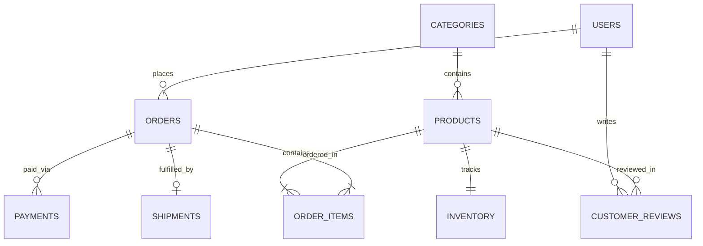

# SQL Database Understanding & Analytics Project

A hands-on relational database project designed to practice database normalization (3NF), complex SQL queries (CTEs, Window Functions, Grouping), stored procedures, triggers, and query performance tuning.

This repository models an Indian e-commerce data warehouse (**BharatCart**) tracking customers, products, inventory, orders, payments, and shipments.

---

## 📌 Project Overview

The objective of this project is to build and analyze an end-to-end relational schema from scratch:
1. **Schema Design (`01_schema.sql`)**: 10 tables in 3NF with Primary Keys, Foreign Keys, `CHECK` constraints, and performance indexes.
2. **Mock Data Generation (`02_seed_data.sql`)**: Realistic multi-month transactional data focusing on Indian metro cities, UPI/Razorpay/PhonePe payment gateways, and local logistics carriers (Delhivery, BlueDart).
3. **Business Queries (`03_analytics_queries.sql`)**: 10 analytical queries demonstrating:
   - Month-over-Month (MoM) revenue growth using `LAG()`.
   - Customer RFM (Recency, Frequency, Monetary) segmentation via `NTILE(4)`.
   - Pareto 80/20 product classification using cumulative window sums.
   - 7-day rolling revenue trends.
   - Warehouse inventory reorder threshold alerts.
   - Payment gateway failure rate comparisons.
   - Metro city Average Revenue Per User (ARPU).
4. **Views & Automation (`04_procedures_triggers_views.sql`)**: SQL views for executive KPI dashboards and low-stock alerts.
5. **Optimization Guide (`05_optimization_guide.md`)**: `EXPLAIN` query execution plan benchmarks and indexing strategies.
6. **Interactive Dashboard (`index.html`, `styles.css`, `app.js`)**: A lightweight web interface powered by an in-browser SQLite engine (`sql.js`) and `Chart.js` to execute queries and view visual charts live.

---

## 🗺️ Database ER Diagram



---

## 📂 Repository Structure

```
.
├── 01_schema.sql                 # Database table definitions & constraints
├── 02_seed_data.sql               # Mock transactional dataset
├── 03_analytics_queries.sql       # 10 business analytics queries
├── 04_procedures_triggers_views.sql # SQL views & stored procedures
├── 05_optimization_guide.md       # Indexing benchmarks & EXPLAIN plans
├── index.html                     # Web Dashboard UI
├── styles.css                     # UI Stylesheet
├── app.js                         # In-browser SQLite query runner & chart renderer
└── README.md
```

---

## 💡 Key SQL Queries Covered

### 1. Month-over-Month (MoM) Revenue Growth
```sql
WITH MonthlyMetrics AS (
    SELECT
        STRFTIME('%Y-%m', order_date) AS order_month,
        COUNT(DISTINCT order_id) AS total_orders,
        SUM(total_amount) AS monthly_revenue_inr
    FROM orders
    WHERE order_status = 'Completed'
    GROUP BY STRFTIME('%Y-%m', order_date)
)
SELECT
    order_month,
    total_orders,
    monthly_revenue_inr,
    COALESCE(LAG(monthly_revenue_inr) OVER (ORDER BY order_month), 0) AS prev_month_revenue_inr,
    ROUND(
        COALESCE((monthly_revenue_inr - LAG(monthly_revenue_inr) OVER (ORDER BY order_month)) 
        / NULLIF(LAG(monthly_revenue_inr) OVER (ORDER BY order_month), 0) * 100, 0), 2
    ) AS mom_growth_pct
FROM MonthlyMetrics;
```

### 2. Customer RFM Segmentation (`NTILE(4)`)
```sql
WITH BaseRFM AS (
    SELECT
        u.user_id,
        u.full_name,
        u.city,
        CAST(JULIANDAY('2024-02-15') - JULIANDAY(MAX(o.order_date)) AS INT) AS recency_days,
        COUNT(o.order_id) AS frequency,
        SUM(o.total_amount) AS monetary_val_inr
    FROM users u
    JOIN orders o ON u.user_id = o.user_id
    WHERE o.order_status = 'Completed'
    GROUP BY u.user_id, u.full_name, u.city
)
SELECT
    full_name,
    city,
    recency_days,
    frequency,
    monetary_val_inr,
    NTILE(4) OVER (ORDER BY recency_days ASC) AS R_Score,
    NTILE(4) OVER (ORDER BY frequency DESC) AS F_Score,
    NTILE(4) OVER (ORDER BY monetary_val_inr DESC) AS M_Score
FROM BaseRFM;
```

---

## 🛠️ How to Run Locally

### Option 1: Live Interactive Browser Sandbox
Open `index.html` directly in any web browser or start a simple HTTP server:
```bash
python -m http.server 8000
```
Navigate to `http://localhost:8000` to run queries interactively.

### Option 2: Database Command Line (PostgreSQL / MySQL / SQLite)
```bash
sqlite3 database.db < 01_schema.sql
sqlite3 database.db < 02_seed_data.sql
sqlite3 database.db < 03_analytics_queries.sql
```
